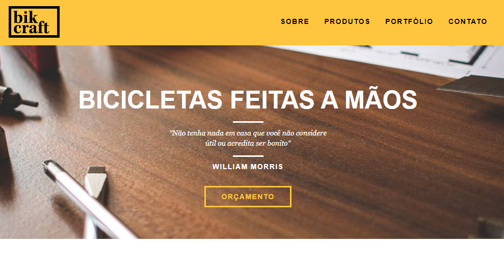

<h1 align="center">
  
</h1>

  <a href="#-tecnologias">Tecnologias</a>&nbsp;&nbsp;&nbsp;|&nbsp;&nbsp;&nbsp;
  <a href="#-projeto">Projeto</a>&nbsp;&nbsp;&nbsp;|&nbsp;&nbsp;&nbsp;

 

  

## 🚀 Tecnologias

Esse projeto foi desenvolvido com as seguintes tecnologias:

- HTML
- CSS
- JavaScript
- PHP

## 💻 Projeto

O projeto da Bikcraft é um site institucional desenvolvido no curso Web Design Completo, realizado através da plataforma Origamid com 44 horas de duração.

Abordando conceitos desde Tipografia, Cores, Adobe XD, até chegarmmos na codificação do projeto.
 
_________

Feito com 💜 👋 [Check out my LinkedIn](https://www.linkedin.com/in/william-souza-0967337b/)